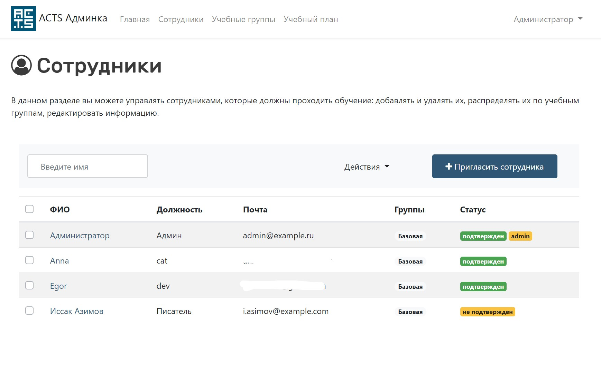

# Автоматическая система тренинга кибербезопасности
(Automatic Cybersecurity Training System)

### Скриншоты приложения:
Администрвативная панель - управление пользователями:

### Установка

1. Клонируйте репозиторий <code>git clone https://github.com/evn88/ACTS.git</code>
2. Скопируйте и переименуйте файл <b>.env.example</b>  в <b>.env</b>, далее укажите ваши настройки для БД и вашего почтового сервера, через который будут отправляться сообщения.
3. <code>composer install</code>
4. <code>npm install</code>
5. <code>php artisan key:generate</code>
6. <code>php artisan passport:keys</code>
7. <code>php artisan vendor:publish --tag=assets --force</code>
8. <code>php artisan migrate</code>
9. <code>php artisan db:seed</code>
10. Приложение использует очереди и Supervisor https://laravel.ru/docs/v5/queues
11. Установите Supervisor <code>sudo apt-get install supervisor</code>
12. Файлы настроек Supervisor обычно находятся в папке /etc/supervisor/conf.d. Там вы можете создать любое количество файлов с настройками, по которым Supervisor поймёт, как отслеживать ваши процессы. Для работы аукциона, создадим файл laravel-worker-acts.conf, который запускает и наблюдает за процессом queue:work:
<pre>
   [program:laravel-worker-acts]
    process_name=%(program_name)s_%(process_num)02d
    command=php /var/www/[ПУТЬ ДО ПРИЛОЖЕНИЯ]/artisan queue:work --sleep=3 --tries=3 --daemon
    autostart=true
    autorestart=true
    user=www-data
    numprocs=4
    redirect_stderr=true
    stdout_logfile=/var/www/[ПУТЬ ДО ПРИЛОЖЕНИЯ]/storage/logs/worker.log
</pre>
Подробнее о Supervisor читайте в его [документации](http://supervisord.org/index.html).

13. После создания файла настроек вы можете обновить конфигурацию Supervisor и запустить процесс при помощи следующих команд:  
    <code>sudo supervisorctl reread</code> 
    <code>sudo supervisorctl update</code> 
    <code>sudo supervisorctl start laravel-worker:*</code>
    
## Авторское право и лицензия

ACTS написан E & A Вершковы на платформе Laravel и выпущен под лицензией GNU AGPLv3.
Подробности смотрите в файле License.

----

# Automatic Cybersecurity Training System

### Install

1. Clone Repository <code>git clone https://github.com/evn88/ACTS.git</code>
2. Copy and rename file <b>.env.example</b>  to <b>.env</b>, then specify your settings for the database and your mail server through which messages will be sent.
3. <code>composer install</code>
4. <code>npm install</code>
5. <code>php artisan key:generate</code>
6. <code>php artisan passport:keys</code>
7. <code>php artisan vendor:publish --tag=assets --force</code>
8. <code>php artisan migrate</code>
9. <code>php artisan db:seed</code>
10. Application uses Queues and Supervisor https://laravel.ru/docs/v5/queues
11. Install Supervisor <code>sudo apt-get install supervisor</code>
12. Supervisor configuration files are usually located in the /etc/supervisor/conf.d folder. There you can create any number of settings files that Supervisor will understand how to track your processes. For the auction to work, create a laravel-worker-acts.conf file that launches and monitors the queue: work process:
<pre>
   [program:laravel-worker-acts]
    process_name=%(program_name)s_%(process_num)02d
    command=php /var/www/[APP PATH]/artisan queue:work --sleep=3 --tries=3 --daemon
    autostart=true
    autorestart=true
    user=www-data
    numprocs=4
    redirect_stderr=true
    stdout_logfile=/var/www/[APP PATH]/storage/logs/worker.log
</pre>
Read more about Supervisor in his [documentation](http://supervisord.org/index.html).

13.After creating the settings file, you can update the Supervisor configuration and start the process with the following commands: 
    <code>sudo supervisorctl reread</code> 
    <code>sudo supervisorctl update</code> 
    <code>sudo supervisorctl start laravel-worker:*</code>

## Copyright and License

ACTS is written by Vershkovs E & A on the Laravel framework and is released under the GNU AGPLv3 License.
See the LICENSE file for details.
